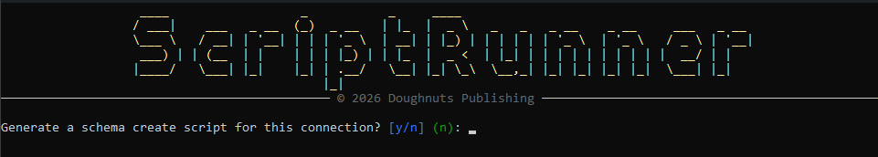
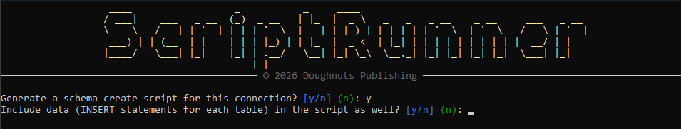

# ScriptRunner

[](https://github.com/cccsdh/Dnp.ScriptRunner/actions/workflows/dotnet-build.yml)

ScriptRunner is a .NET 10 application for executing and managing scripts in a reproducible, auditable way. It provides a lightweight framework to run scripts, manage execution context, and capture results for automation and operational tasks.

For a walkthrough of every interactive prompt, including the schema create script feature, see the [User Guide](USER_GUIDE.md).


## Key features

- Cross-platform .NET 10 application
- Run one-off or batched scripts
- Capture and persist stdout/stderr and exit codes
- Designed to integrate with CI/CD pipelines
- Generate a schema create script (DDL) directly from a live database connection, for any supported provider
- Optionally include INSERT statements for existing table data alongside the generated schema

## Requirements

- .NET 10 SDK (https://dotnet.microsoft.com) 
- Windows, macOS, or Linux

## Build


Restore packages and build the solution:

```bash
dotnet restore
dotnet build --configuration Release
```

## Run

Run the application (adjust project path if needed):

```bash
dotnet run --project ./ScriptRunner/Dnp.ScriptRunner.csproj
```

Or execute the produced binary from the `bin` folder after a build:

```bash
./ScriptRunner/bin/Release/net10.0/win-x64/Dnp.ScriptRunner.exe
```

## Command-line (non-interactive) mode

ScriptRunner can be started non-interactively by providing three arguments: the database type, the connection string, and the scripts directory. When invoked with these parameters the application will bypass the interactive UI prompts and immediately start processing scripts in the provided directory.

Usage:

```bash
dotnet run --project ./ScriptRunner/Dnp.ScriptRunner.csproj -- <DatabaseType> "<ConnectionString>" "<ScriptsDirectory>"
```

Or after building the binary:

```bash
./ScriptRunner/bin/Release/net10.0/win-x64/Dnp.ScriptRunner.exe <DatabaseType> "<ConnectionString>" "<ScriptsDirectory>"
```

Arguments:
- DatabaseType: One of PostgreSQL, SqlServer, Sqlite, MySQL, Oracle, DB2
- ConnectionString: The full connection string for the selected provider (wrap in quotes if it contains spaces)
- ScriptsDirectory: Full path to the folder containing .sql and .txt scripts to execute

Example:

```bash
dotnet run --project ./ScriptRunner/Dnp.ScriptRunner.csproj -- PostgreSQL "Host=localhost;Username=app;Password=pass;Database=mydb" "C:\scripts"
```

When run in CLI mode, the application will automatically persist the supplied connection string and scripts directory into Settings if they are not already present.


## Schema create script generation

In interactive mode, after you enter or select a connection string, ScriptRunner asks:

> **Generate a schema create script for this connection?**

Answering **No** continues into the normal script-running flow (pick a scripts directory, select files, run them).

Answering **Yes** switches into a separate, one-shot workflow:

1. You're asked **Include data (INSERT statements for each table) in the script as well?**
2. You pick (or create) an output directory. If the directory doesn't exist yet, it is created automatically.
3. ScriptRunner connects to the database and generates a single `.sql` file named `schema-create-<DatabaseType>-<timestamp>.sql` in that directory, then exits — no scripts are run in this mode.

The generated script includes, for every user schema/database reachable via the connection:

- `CREATE SCHEMA` (or the provider's equivalent) statements, for providers that have a separate schema concept
- `CREATE TABLE` statements, including columns, defaults, identity/auto-increment columns, primary/unique/foreign key constraints, and indexes
- Views, functions, stored procedures, and triggers
- If you opted in at step 1, an `INSERT INTO` statement for every existing row in every table

Each object is generated using the target database's own native DDL-reflection mechanism, so the output matches what the database actually has, not a best-effort guess:

| Provider | Schema statement | Table DDL source | Views / functions / procedures / triggers |
|---|---|---|---|
| PostgreSQL | `CREATE SCHEMA IF NOT EXISTS` | `information_schema` + `pg_constraint` / `pg_indexes` | `pg_get_viewdef`, `pg_get_functiondef`, `pg_get_triggerdef` |
| SQL Server | Guarded `CREATE SCHEMA` (skipped for `dbo`) | `sys.columns` + `sys.key_constraints` / `sys.foreign_keys` / `sys.indexes` | `sys.sql_modules.definition` (each object separated by `GO`, since SQL Server requires these to be alone in their batch) |
| MySQL | `CREATE SCHEMA IF NOT EXISTS` + `USE` (schema = database in MySQL) | `SHOW CREATE TABLE` | `SHOW CREATE VIEW` / `PROCEDURE` / `FUNCTION` / `TRIGGER` |
| Oracle | Not applicable (schema = the connected user) | `DBMS_METADATA.GET_DDL('TABLE', ...)` | `DBMS_METADATA.GET_DDL('VIEW'/'FUNCTION'/'PROCEDURE'/'TRIGGER', ...)` |
| DB2 | `CREATE SCHEMA` | `SYSCAT.COLUMNS` + `SYSCAT.TABCONST` / `SYSCAT.REFERENCES` / `SYSCAT.INDEXES` | `SYSCAT.VIEWS` / `SYSCAT.ROUTINES` / `SYSCAT.TRIGGERS` (`TEXT` column) |
| SQLite | Not applicable (no schema concept) | Original `CREATE TABLE` text from `sqlite_master` | Also read directly from `sqlite_master` (SQLite has no stored procedure/function concept) |

If a particular object can't be scripted (for example, a permissions issue on one table), a `-- Failed to generate DDL for ...` comment is written in its place and generation continues with the remaining objects.

**Notes on the data option:**
- Values are formatted from each column's actual type (numbers unquoted, strings quoted and escaped, dates/binary formatted per provider).
- SQL Server tables with an identity column are wrapped in `SET IDENTITY_INSERT ... ON/OFF` so the existing key values can be reinserted as-is.
- Tables are scripted in the same order as the schema (alphabetical for most providers), which is **not** foreign-key-dependency aware — you may need to reorder statements or disable constraint checking when loading the data into a fresh database with FK relationships.


## UI Prompt Examples

Main Screen:


Connection Screen:


Script Management Screen:


Script Selection Screen:


End of Run Screen:


Generate Create Script Screen:


Include Data Screen:



## Contributing

Contributions are welcome. Typical workflow:

1. Fork the repository
2. Create a feature branch
3. Add tests and update documentation
4. Open a pull request describing the changes

Follow existing coding styles and include unit/integration tests for new behavior.

## License

This project is licensed under the MIT License. See the `LICENSE` file in the repository for the full license text.

## Contact

For questions or support, open an issue in this repository.
