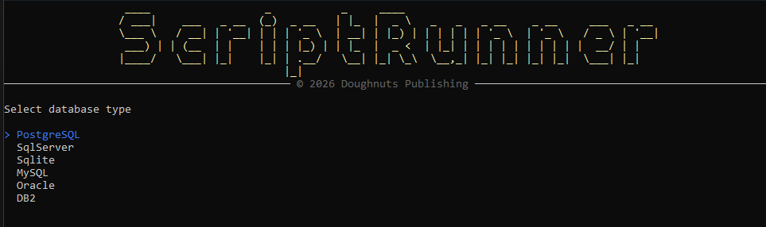
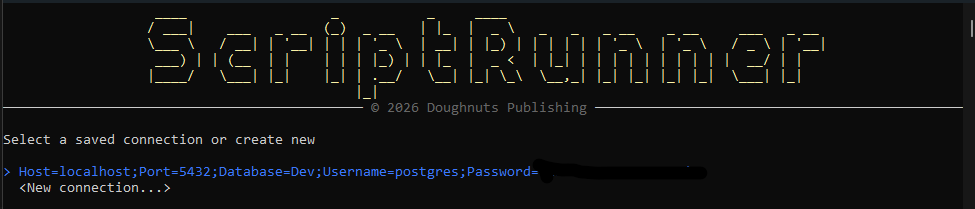
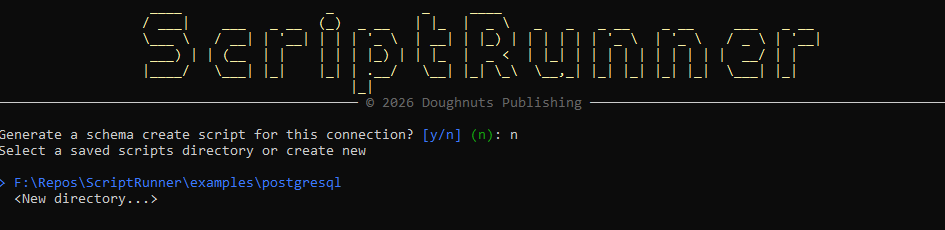
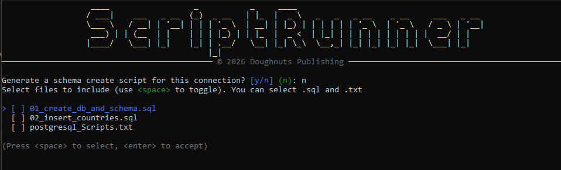
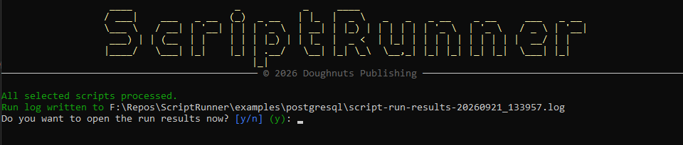

# ScriptRunner

[](https://github.com/cccsdh/Dnp.ScriptRunner/actions/workflows/dotnet-build.yml)

ScriptRunner is a .NET 8\.NET 10.0 application for executing and managing scripts in a reproducible, auditable way. It provides a lightweight framework to run scripts, manage execution context, and capture results for automation and operational tasks.


## Key features

- Cross-platform .NET 8\.NET 10.0 application
- Run one-off or batched scripts
- Capture and persist stdout/stderr and exit codes
- Designed to integrate with CI/CD pipelines

## Requirements

- .NET 8 SDK (https://dotnet.microsoft.com) or .NET 10.0 SDK (https://dotnet.microsoft.com)
- Windows, macOS, or Linux

## Build

Restore packages and build the solution:

```bash
dotnet restore
dotnet build --configuration Release
```

## Run

Run the application (adjust project path if needed):

```bash
dotnet run --project ./src/ScriptRunner/ScriptRunner.csproj
```

Or execute the produced binary from the `bin` folder after a build:

```bash
dotnet ./bin/Release/net8.0/ScriptRunner.exe
```

## Examples

Main Screen:


Connection Screen:


Script Management Screen:


Script Selection Screen:


End of Run Screen:



## Contributing

Contributions are welcome. Typical workflow:

1. Fork the repository
2. Create a feature branch
3. Add tests and update documentation
4. Open a pull request describing the changes

Follow existing coding styles and include unit/integration tests for new behavior.

## License

This project is licensed under the MIT License. See the `LICENSE` file in the repository for the full license text.

## Contact

For questions or support, open an issue in this repository.
